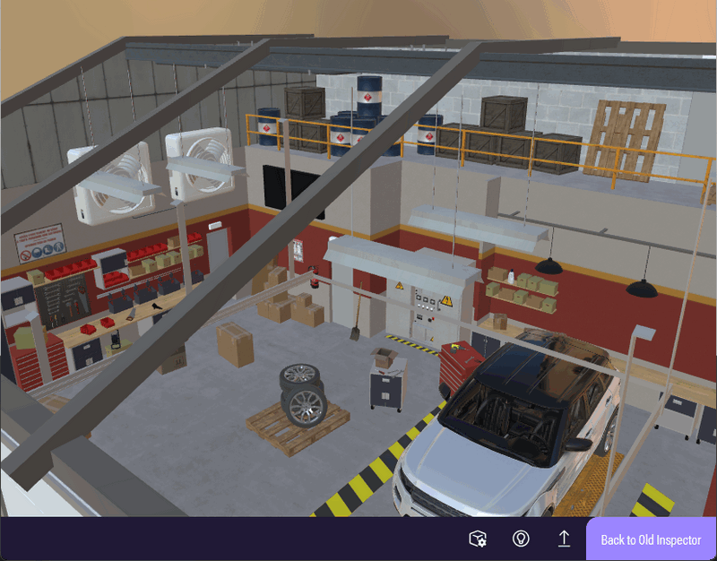
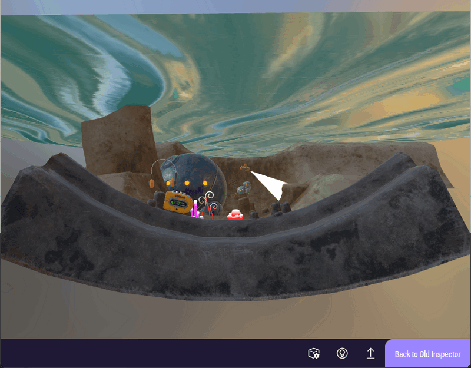

# Sample files for bug reports 

## Issues met when testing BabylonJS Editor

- `garage` : 
   - the GLTF won't open after it was imported into the Editor
   - when converted into BJS format, the editor's screen turns to white
- `marine_melodies` : 
   - the GLTF won't open after it was imported into the Editor
   - when converted into BJS format, the editor's screen turns to white

### Screen captures of the files above showing up in the BabylonJS Sandbox

 

